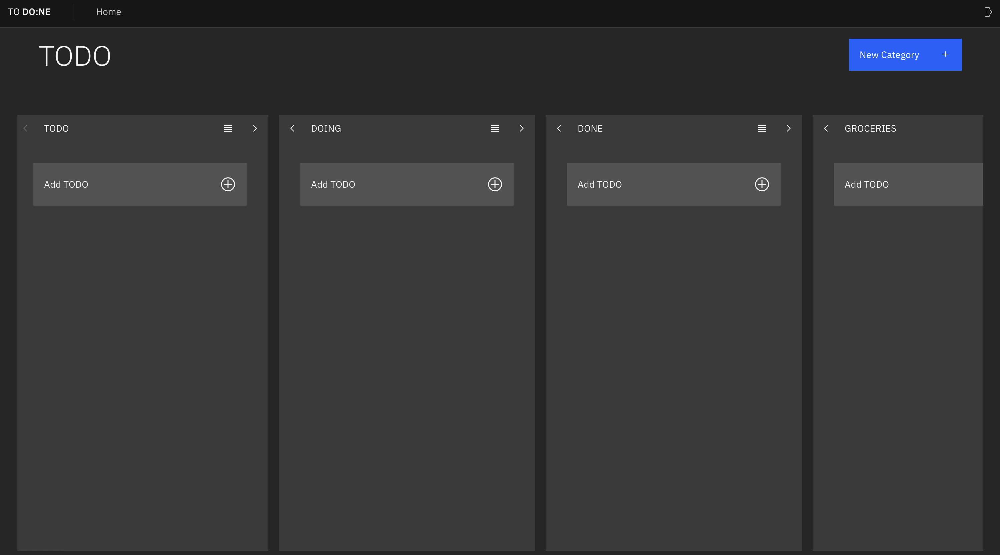

# TODO:NE

## Description

- TODO:NE is a simple TODO list application that allows you to list out things you need to do so that you can stay organized. 

- TODO:NE is a collaborative MERN-stack single-page application. It combines a scalable MongoDB back end, a GraphQL API, and an Express.js and Node.js server with a React front end. It implements user authentication with JWT to build a user-focused platform. 

## Installation

- `npm install` from the root of the project
- in the server folder, create your `.env` file using the `example.env` file
- to start developing, `npm run develop`
- to run production, build the client (`npm run build`), then run `npm run start`.

## Usage

## Credits

- [Amanda Pietsch](https://www.github.com/apietsch4117)
- [Daniel Yang](https://www.github.com/danielshang11)
- [Genesis (Oliver) Gregorio](https://www.github.com/theurbanspectacle)
- [Nathan Difiori](https://www.github.com/ndifiori)
- [Samantha McMillan](https://www.github.com/sdanimc)

## License

N/A

## Technologies Used
- React (Front End)
- GraphQL, Node.js, and Express.js server
- MongoDB and Mongoose ODM for database.
- Queries and Mutations for retrieving, adding, updating, and deleting data.
- Heroku for deployment
- JWT for authentication
- Carbon Design System
